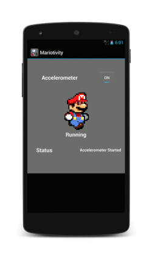
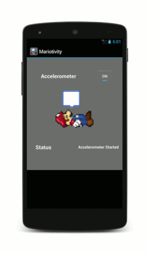

Mariotivity
===========
Mariotivity is only one of the many apps created during the course "Mobile Health Sensing and Analytics" in the fall semester 2014 at the computer science department of UMASS, Amherst.

Just by using sensors of an Android smartphone itself (accelerometer, gyroscope), it is able to detect whether the user is currently standing still or moving. In some cases, it is even able to distinguish between walking and running.

The creation of this app had three critical steps:

1. Collection of data
2. Building a classifier with a model
3. Implementing the classifier in the Android app and connect it with live sensor data

Each of these steps were done by our team. The classifier was built in Weka using the data that we collected beforehand ("manually", by walking with the phone in our hands and in our pockets).

*Creators: [Yinglai Yang](https://de.linkedin.com/in/yinglaiyang), [Mike Steele](https://www.linkedin.com/in/mikesteeledev), [Pruthvi Desai](https://www.linkedin.com/in/pruthvi-desai-4ab5a742)*

Download
--------
You can download the app with this link: [Mariotivity APK](./app/build/outputs/apk/app-debug.apk)
